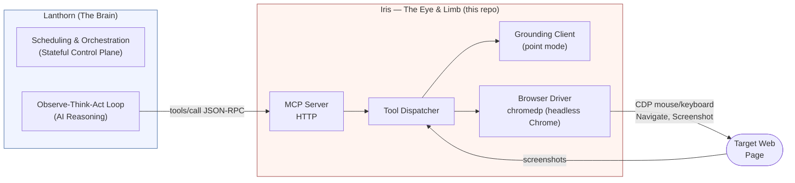

# Iris — The Eye of AI-Native Synthetic Monitoring

Iris is a stateless, vision-first MCP server that exposes **9 browser-control tools** over the Model Context Protocol (MCP / JSON-RPC 2.0). It operates as the "limb and eye" of **Lanthorn**—the control plane and orchestrator for autonomous synthetic monitoring.

Instead of traditional HTML selectors or brittle CSS paths, Iris uses a **"Vision-First" coordinate-first interface**. It sees target web screens exactly as human users do, rendering it immune to the frontend changes that break standard testing scripts.



---

## The Brain-and-Limb Metaphor

Iris is designed to be intentionally thin and stateless. It executes low-level visual and mechanical interactions on behalf of **Lanthorn**:

1. **The Command Loop:** Lanthorn prepares an **Execution Payload** (including instructions, URLs, and grounding credentials) and triggers an Iris tool call.
2. **Coordinate-First Interface:** Lanthorn does not ask Iris to traverse the DOM. Lanthorn requests a `screenshot()`, runs grounding, and instructs Iris to `click(x, y)` or `type_text()`. Iris only executes coordinates, mouse events, and key injections.
3. **Evidence Reporting:** Iris reports pixel-diffs, execution latency, and raw screenshots back to Lanthorn to build the **Evidence Store** (stored in S3 for rich, step-by-step diagnostic trails).
4. **Autonomous Recovery:** If a click has no effect, Lanthorn's AI Brain reasons about a recovery strategy and issues a new sequence of instructions to Iris.


---

## Tools

| Tool | Description |
|---|---|
| `navigate` | Navigate the browser to a URL |
| `screenshot` | Capture a screenshot of the current viewport (JPEG, base64) |
| `click` | Click at viewport coordinates; supports double-click |
| `type_text` | Type text into the focused element, or into an element found by description (uses vision grounding) |
| `scroll` | Scroll the page up or down by a number of steps |
| `wait_for_stable` | Poll screenshots until the page is visually stable (no changes between consecutive frames) |
| `verify_screen` | Ask the vision model a yes/no question about the current page state |
| `sleep` | Sleep for a fixed number of milliseconds |
| `get_datetime` | Get the current date and time on the execution node |

### Vision Grounding: `type_text` with description

When `type_text` is called with a `description` parameter, it takes a screenshot, uses the vision grounding model to locate the element, clicks it to focus, waits briefly, then types the text. When `description` is omitted, it types into whatever element currently has focus.

The model returns a single center point `[x, y]`. Iris expands it into a bounding box using `IRIS_GROUNDING_POINT_CLICK_RADIUS` (default: 15 px) and clicks the center.

### Click Annotation

When `IRIS_ANNOTATE_CLICKS=1`, the `click` and `type_text` tools draw a red dot at the click coordinates on the post-click screenshot. This helps the agent visually verify where it clicked.

### Screen Verification: `verify_screen`

`verify_screen` asks the vision model a yes/no question and returns:

```json
{"answer": "yes", "evidence": "A Save dialog with an OK button is visible", "bbox": [400, 200, 1000, 600]}
```

It accepts either a fresh screenshot (taken automatically) or a pre-captured `image_base64` from the caller.

---

## Usage

Iris runs as an HTTP MCP server on `0.0.0.0:3000` by default.

```bash
./iris
```

```bash
# Initialize
curl -X POST http://localhost:3000/mcp \
  -H 'Content-Type: application/json' \
  -d '{"jsonrpc":"2.0","id":1,"method":"initialize","params":{}}'

# List tools
curl -X POST http://localhost:3000/mcp \
  -H 'Content-Type: application/json' \
  -d '{"jsonrpc":"2.0","id":2,"method":"tools/list","params":{}}'

# Call a tool (with auth)
curl -X POST http://localhost:3000/mcp \
  -H 'Content-Type: application/json' \
  -H 'Authorization: Bearer your-api-key' \
  -d '{"jsonrpc":"2.0","id":3,"method":"tools/call","params":{"name":"screenshot","arguments":{}}}'
```

### Running via Docker

```bash
# Build
docker build -t iris .

# Run (interactive)
docker run --rm \
  -p 3000:3000 \
  --add-host=host.docker.internal:host-gateway \
  -e IRIS_ADDR=0.0.0.0:3000 \
  iris

# Run (detached)
make docker/start

# View logs
make docker/logs

# Stop
make docker/stop
```

### Typical agent interaction

```
Agent: "I need to fill in the search box"
  → type_text(text="hello world", description="the search box")
  ← {success: true, x: 640, y: 200, method: "vision", confidence: 0.5}

Agent: "Did the results appear?"
  → verify_screen(question="Are search results visible on the page?")
  ← {answer: "yes", evidence: "A list of results is displayed below the search box", x1: 100, y1: 300, x2: 1820, y2: 900}
```

Or a lower-level coordinate-based flow:

```
Agent: "Take a screenshot"
  → screenshot()
  ← {image_base64: "...", width: 1920, height: 1080}

Agent: "Click at (500, 400)"
  → click(x=500, y=400)
  ← {success: true, image_base64: "..."}

Agent: "Wait for the page to settle"
  → wait_for_stable(timeout_ms=5000)
  ← {stable: true, elapsed_ms: 1200}
```

---

## Configuration

All configuration is via environment variables with the `IRIS_*` prefix. See [`.env.example`](.env.example) for the full list with defaults.

Key variables:

| Env Var | Description |
|---|---|
| `IRIS_ADDR` | HTTP listen address (default `0.0.0.0:3000`) |
| `IRIS_API_KEY` | API key for HTTP mode auth |

Logs go to stderr as structured text (`slog`). The `/health` endpoint is always unauthenticated.

---

## Requirements

- Go 1.24+
- Google Chrome or Chromium installed (or in the Docker image)

---

## Build

```bash
make build
# or
go build -o bin/iris ./cmd/iris
```

---

## Testing

```bash
# Unit tests (no browser required)
make test

# Lint
make lint

# Full check
make lint && make test
```

CI runs build + lint + unit tests on Linux via GitHub Actions.

---

## Coordinate System

All coordinates are **viewport pixels** — (0,0) is the top-left corner of the browser viewport. Coordinates returned by grounding are center-points of bounding boxes, ready to pass directly to `click`.

The grounding model uses a normalized 0–1000 coordinate space internally. Iris maps these back to pixel coordinates based on the actual screenshot dimensions.

---

## Troubleshooting

**Browser not starting** — Ensure Chrome/Chromium is installed. On Linux, you may need to install additional dependencies. Use `IRIS_CHROME_PATH` to specify the binary path if it's not on `PATH`.

**Screenshots are blank** — Make sure `IRIS_HEADLESS=true` (the default). If running in a Docker container, ensure `--shm-size=2g` or `--no-sandbox` is set.

**`type_text` with description fails** — Check that `IRIS_GROUNDING_URL` is set and the grounding model is accessible.

**`verify_screen` always returns "no"** — Confirm the question is unambiguous. The model receives the same screenshot as grounding, so if `screenshot()` looks correct, the issue is likely question phrasing or model quality.

---

For architecture details, transport specifics, and the grounding pipeline: [architecture.md](architecture.md).

## License

This project is licensed under the [MIT License](LICENSE).