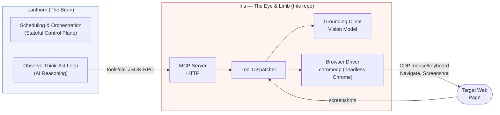
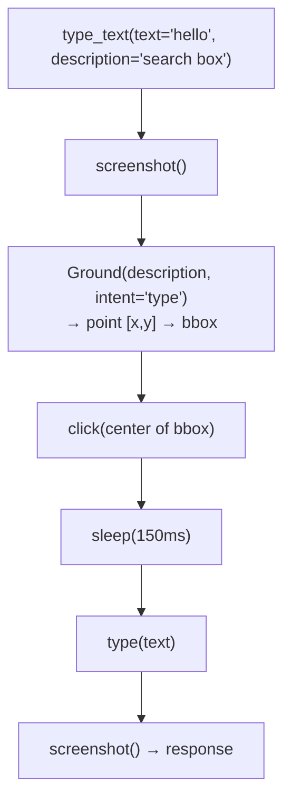
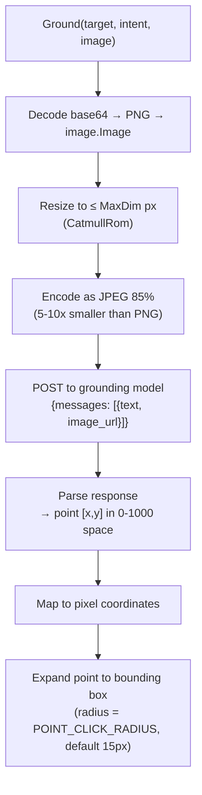

# Architecture

## Overview

Iris is a stateless, vision-first MCP server that exposes **9 browser-control tools** (registered from 11 internal source files, where `annotate.go` and `overlay.go` act as drawing utilities) over the Model Context Protocol (MCP / JSON-RPC 2.0). It functions as the **eye and limb** of **Lanthorn** (the centralized synthetic monitoring brain and control plane), executing low-level coordinate-based actions and screenshot-capturing on target web applications without managing persistent states, routing logic, or execution schedules.

Instead of navigating via fragile HTML elements, Iris relies on a coordinate-first vision interaction loop, making it resilient against frontend interface shifts.



---

## Lanthorn & Iris: Brain-and-Limb Orchestration

Iris operates as a thin execution layer for **Lanthorn**, which drives the intelligent synthetic monitoring ecosystem:

1. **Flow Orchestration:** Lanthorn's stateful control plane triggers custom cron schedules or manual flows defined in natural language.
2. **AI Reasoning Loop:** Lanthorn analyzes screenshots returned by Iris, consults grounding models to resolve coordinates, and sends low-level actions (`click`, `type_text`, `scroll`) to Iris via JSON-RPC.
3. **Stateless Mechanical Execution:** Iris focuses solely on executing browser commands (mouse movements, key injection, screenshots) via chromedp.
4. **Diagnostic Evidence Trails:** Iris streams post-click screenshots and metrics back to Lanthorn, which compiles visual overlays and logs into the S3-powered Evidence Store.


---

## Transport Layer

Iris runs as an HTTP server, accepting `POST /mcp` with JSON-RPC bodies:

```
POST http://localhost:3000/mcp
Content-Type: application/json
Authorization: Bearer <key>

{"jsonrpc":"2.0","id":1,"method":"tools/call","params":{"name":"click","arguments":{"x":500,"y":400}}}
```

A `/health` endpoint is available at `GET /health` (always unauthenticated). All other requests check `Authorization: Bearer` or `X-Api-Key` when `IRIS_API_KEY` is set.

---

## Startup Sequence

```
main.go
  ├── godotenv.Load()                    Load .env if present
  ├── slog.New(JSONHandler → stderr)     Must happen before any tool is constructed
  ├── browser.NewDriver(ctx, logger, cfg)  Start headless Chrome via chromedp
  ├── grounding.NewClient(cfg, logger)   Create grounding HTTP client
  ├── mcp.NewServer(logger, version)     Create server
  ├── registry.RegisterAll(server)
  │     ├── Navigate
  │     ├── Screenshot
  │     ├── Click
  │     ├── TypeText        (with GroundingClient for description-based typing)
  │     ├── Scroll
  │     ├── WaitForStable
  │     ├── VerifyScreen    (with VerifyClient for vision verification)
  │     ├── Sleep
  │     └── GetDatetime
  ├── signal.Notify(SIGINT, SIGTERM) → context.Cancel
  └── server.RunHTTP(ctx, addr)
```

`slog.SetDefault(logger)` is called before any tool is constructed. This prevents package-level loggers from using the default handler that writes to stdout.

---

## Tool Interface

Every tool implements:

```go
type Tool interface {
    Name() string
    Description() string
    ParametersSchema() map[string]any
    Execute(ctx context.Context, args map[string]any) (any, error)
}
```

Tools are registered via `ToolRegistry.RegisterAll(server)` in `internal/tools/registry.go`. The MCP dispatcher calls `Execute(ctx, args)` where `args` is a `map[string]any` decoded from the JSON-RPC params. Since JSON numbers decode as `float64` in Go, two helpers handle argument extraction:

- `intArg(args, name)` — required integer, errors if missing or invalid
- `optIntArg(args, name, default)` — optional integer, returns default if absent

All integer helpers clamp to `[0, MaxInt32]`.

---

## Browser Driver

`browser.Driver` is an interface with 8 methods:

| Method | Description |
|--------|-------------|
| `Navigate(ctx, url)` | Navigate to a URL, wait for `body` ready |
| `Click(ctx, x, y)` | CDP mouse events: move → press → release |
| `Type(ctx, text, delayMs)` | Send keys via CDP `SendKeys` |
| `Scroll(ctx, direction, clicks)` | `window.scrollBy` via CDP |
| `Screenshot(ctx)` | Full-page JPEG screenshot via CDP |
| `WaitForStable(ctx, timeoutMs, threshold)` | Poll screenshots until identical |
| `Title(ctx)` | Get the current page title |
| `Close()` | Cancel chromedp contexts |

The chromedp implementation is in `internal/browser/chromedp_driver.go`. It creates an `ExecAllocator` with headless flags, a browser context, and applies a configurable timeout via `context.WithTimeout` for each action.

### Mouse Events

Click uses three sequential CDP actions via `input.DispatchMouseEvent`:
1. `MouseMoved` to (x, y)
2. `MousePressed` with `Button: Left`, `ClickCount: 1`
3. `MouseReleased` with `Button: Left`, `ClickCount: 1`

Double-click repeats this sequence twice with a 50ms pause between.

### Screenshot Pipeline

`FullScreenshot` returns raw PNG bytes from CDP. These are decoded via `image.Decode`, re-encoded as JPEG 85% quality, and base64-encoded for transport. If decode fails, raw bytes are base64-encoded as-is.

---

## Vision Grounding

### Grounding: `type_text` with description

When `type_text` is called with a `description` parameter, it performs a screenshot → grounding → click → type flow:



### Grounding Pipeline



The model returns a single `[x, y]` center point. Iris expands it into a bounding box of radius `IRIS_GROUNDING_POINT_CLICK_RADIUS` (default: 15px) and clicks the center.

---

## Screen Verification: `verify_screen`

`verify_screen` reuses the same grounding HTTP pipeline but with a different system prompt. It asks the vision model a yes/no question and returns a structured answer:

```json
{"answer": "yes", "evidence": "A Save dialog with an OK button is visible", "bbox": [400, 200, 1000, 600]}
```

The tool accepts either a fresh screenshot (taken automatically) or a pre-captured `image_base64` from the caller — which avoids an extra capture if the agent just called `screenshot()`. An annotated overlay image is saved to the screenshots directory for debugging.

A separate model can be configured for verification via `IRIS_VERIFY_MODEL` — useful if a larger, more capable model is preferred for assertions while a faster one handles element location.

Debug overlays are saved as PNG files to `$IRIS_SCREENSHOT_DIR` if set, otherwise to `os.UserCacheDir()/iris/`.

---

## Click Annotation

When `IRIS_ANNOTATE_CLICKS=1`, the `click` and `type_text` tools draw a semi-transparent red dot at the click coordinates on the post-click screenshot. This helps the agent visually verify where it clicked. The annotation is embedded in the base64 response image, not saved to disk.

---

## Directory Layout

```
iris/
├── cmd/
│   └── iris/main.go                 Entry point: browser driver init, wire tools, serve
├── internal/
│   ├── browser/
│   │   ├── browser.go               Driver interface + Config + ConfigFromEnv
│   │   ├── chromedp_driver.go       chromedp implementation
│   │   └── browser_test.go          Mock Driver + Config tests
│   ├── mcp/
│   │   ├── server.go                MCP server: JSON-RPC 2.0, RunHTTP
│   │   ├── server_test.go
│   │   └── server_assert_test.go    HTTP integration + auth + timeout tests
│   ├── grounding/
│   │   ├── client.go                HTTP client for vision grounding (point mode) and verification
│   │   └── client_test.go
│   ├── metrics/
│   │   └── metrics.go                Prometheus metrics (iris_* prefix)
│   └── tools/
│       ├── registry.go              ToolRegistry.RegisterAll — single registration point
│       ├── args.go                  intArg / optIntArg helpers
│       ├── schemas.go               Response types (ScreenshotResponse, ClickResponse, etc.)
│       ├── types.go                 Interface types (GroundingClient, VerifyClient), type aliases
│       ├── annotate.go              Click dot drawing helpers
│       ├── overlay.go               Debug overlay drawing (verify bboxes, save to disk)
│       ├── navigate.go              Navigate tool
│       ├── capture.go                Screenshot tool
│       ├── click.go                 Click tool (single + double)
│       ├── type_text.go             TypeText tool (with optional description-based grounding)
│       ├── scroll.go                Scroll tool
│       ├── wait.go                  WaitForStable tool
│       ├── verify_screen.go         VerifyScreen tool
│       ├── sleep.go                 Sleep tool
│       ├── get_datetime.go          GetDatetime tool
│       └── tools_test.go           Tool unit tests (mock Driver + mock GroundingClient)
├── .github/workflows/ci.yml        CI: build + lint + test on Linux
├── Dockerfile                       Chrome + iris binary (no Xvfb)
├── Makefile
├── .golangci.yml
└── AGENTS.md
```

---

## Testing Strategy

| Test type | File | When to run |
|---|---|---|
| MCP protocol | `internal/mcp/server_test.go` | Always |
| MCP HTTP + auth | `internal/mcp/server_assert_test.go` | Always |
| Grounding client | `internal/grounding/client_test.go` | Always (mocks HTTP) |
| Browser driver config | `internal/browser/browser_test.go` | Always |
| Tool unit tests | `internal/tools/tools_test.go` | Always (mocks Driver + GroundingClient) |

All tool unit tests use mock implementations of `browser.Driver`, `GroundingClient`, and `VerifyClient` — no real browser or grounding model required.

---

## Signal Handling and Shutdown

`main.go` installs a goroutine that listens for `SIGINT` / `SIGTERM` and cancels the root context:
- The HTTP server shuts down gracefully with a 5-second timeout
- The browser driver's `Close()` is called via defer to clean up chromedp contexts

---

## Error Handling

- Tools return Go errors; the MCP layer wraps them in JSON-RPC error responses (`code: -32603`)
- No retry logic inside tools — the calling agent decides whether to retry
- Context cancellation is checked before and during long operations (screenshot, grounding HTTP call)
- Grounding errors do not crash the server; they are returned as tool errors so the agent can adapt

---

## Environment Variables

All env vars use the `IRIS_*` prefix. See `.env.example` for the full list with defaults.

| Variable | Default | Description |
|----------|---------|-------------|
| `IRIS_ADDR` | `0.0.0.0:3000` | HTTP listen address |
| `IRIS_API_KEY` | (none) | API key for HTTP transport |
| `IRIS_HEADLESS` | `true` | Run Chrome in headless mode |
| `IRIS_CHROME_PATH` | (auto) | Path to Chrome binary |
| `IRIS_NO_SANDBOX` | `true` | Chrome `--no-sandbox` flag |
| `IRIS_TOOL_TIMEOUT` | `30` | Per-tool-call timeout (seconds) |
| `IRIS_LOG_LEVEL` | `debug` | Log verbosity: `debug`, `info`, `warn`, `error` |
| `IRIS_GROUNDING_URL` | (none) | Grounding model API URL |
| `IRIS_GROUNDING_MODEL` | (none) | Grounding model name |
| `IRIS_ANNOTATE_CLICKS` | (none) | Set to `1` to annotate click positions |
| `IRIS_SCREENSHOT_DIR` | (cache dir) | Directory for debug overlay images |

---

## Known Limitations

- **Headless only**: No visible browser window (intentional — Iris is a server, not a desktop tool)
- **No DOM traversal**: All interaction is coordinate-based (screenshot → grounding → click). No CSS selectors, no XPath.
- **No retry**: Tools do not retry internally. The calling agent is responsible for retry logic.
- **Stateless HTTP**: Each `POST /mcp` is independent — no session, no SSE.
- **Single browser context**: All tools share one browser context (one tab, one page). No multi-tab management. This has critical implications: all tool calls share a single active tab. If tool A navigates to site X and tool B subsequently navigates to site Y, they share the same tab, cookie jar, and local storage. Callers expecting session-level isolation must run separate Iris server instances.