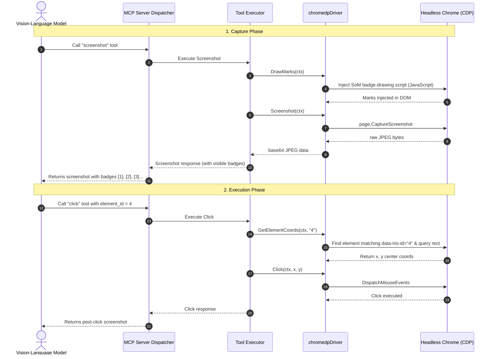

# Architecture Reference Document (ARD): Set-of-Mark (SoM) Visual Grounding

## Metadata
* **Status**: Implemented / Approved
* **Author**: Igor Komlew
* **Date**: May 9, 2026
* **Component**: `Iris` (MCP Browser Execution Server)
* **Target Audience**: AI Agents, Multi-Modal Vision-Language Models (e.g., Gemma 2 26B), Human Developers

---

## 1. Executive Summary & Context

Automated web browser agents using coordinate-based mouse input traditionally rely on multi-modal vision-language models (VLMs) to analyze raw screenshots and predict precise pixel coordinates `(x, y)` of target interactive elements. This approach exposes severe limitations:
* **Spatial Disorientation**: Smaller or locally run models are excellent at textual reasoning but struggle with raw coordinate prediction (spatial grounding), leading to misses, click drifts, and automation fragility.
* **Semantic Deficit**: A raw screenshot lacks explicit indicators of which elements are interactive, forcing models to guess click boundaries.

**Set-of-Mark (SoM)** addresses these problems by dynamically injecting visible, uniquely numbered badges (marks) over all interactive elements on the webpage right before a screenshot is taken. 

```
+-------------------------------------------------------------+
|  [1] Home   [2] Products   [3] Contact                      |
|                                                             |
|  Welcome to our store!                                      |
|                                                             |
|  [4] Click Here to Sign Up                                  |
+-------------------------------------------------------------+
```

With SoM, the VLM's task is simplified from **predicting absolute spatial geometry** to **reading a visible label** (e.g., `"Click on element A"`). The click tool is then upgraded to resolve this element ID into precise pixel coordinates on the screen.

---

## 2. Design Goals

1. **Seamless Automation**: SoM rendering must occur automatically right before a screenshot is captured.
2. **Backward Compatibility**: Existing coordinate-based clicking (`x` and `y`) must remain fully functional as a fallback.
3. **Thread Safety**: All browser DOM manipulations and query actions must serialize via the driver's mutex (`d.mu`) to prevent chromedp concurrent command dispatch errors.
4. **Clean Code & Low Complexity**: Implement coordinate resolution while strictly conforming to linter rules (e.g., avoiding nested `if` statements that violate `nestif` complexity thresholds).
5. **Robust Error Handling**: Handle element absence gracefully, log warnings instead of throwing critical failures if badges fail to draw, and provide actionable feedback.

---

## 3. Workflow & Technical Flow

The following sequence diagram outlines how the Set-of-Mark flow operates during screen capture and subsequent click injection:



---

## 4. Component Architecture Changes

### A. Core Driver Interface
We extended the `Driver` interface in [browser.go](file:///c:/Users/igork/lanthorn/iris/internal/browser/browser.go) with metadata retrieval support:

```go
// SomBounds represents the bounding box of a Set-of-Mark element in viewport pixels.
type SomBounds struct {
	X      float64 `json:"x"`
	Y      float64 `json:"y"`
	Width  float64 `json:"width"`
	Height float64 `json:"height"`
}

// SomElement carries structured textual and spatial metadata for a Set-of-Mark element.
type SomElement struct {
	ID        string    `json:"id"`
	Tag       string    `json:"tag"`
	Text      string    `json:"text"`
	AriaLabel string    `json:"aria_label,omitempty"`
	Role      string    `json:"role,omitempty"`
	Type      string    `json:"type,omitempty"`
	Bounds    SomBounds `json:"bounds"`
}

type Driver interface {
    // ... existing methods
    DrawMarks(ctx context.Context) ([]SomElement, error)
    GetElementCoords(ctx context.Context, id string) (int, int, error)
    PageTree(ctx context.Context) (string, error)
}
```

### B. Chrome DevTools Protocol (chromedp) Implementation
Implemented in [chromedp_driver.go](file:///c:/Users/igork/lanthorn/iris/internal/browser/chromedp_driver.go):

* **`DrawMarks`**: Locks `d.mu` to serialize CDP traffic. Injects a recursive, high-performance JS script that:
  1. Removes stale badges (`.iris-som-mark`).
  2. Queries all candidate interactive selectors, heavily expanded for modern custom UI systems: `button, a, input, select, textarea, [role="button"], [role="link"], [role="tab"], [role="menuitem"], [role="switch"], [role="checkbox"], [contenteditable="true"], [tabindex]:not([tabindex="-1"])`.
  3. Evaluates computed styles to check if `style.cursor === 'pointer'`, capturing custom `<div>`/`<span>` interactive elements that omit ARIA tags.
  4. Recursively crawls same-origin sub-frames (`iframe`) and aggregates candidate coordinates correctly by summing their inner boundaries with parent offset frames (`iframeOffsetTop`, `iframeOffsetLeft`).
  5. Filters candidates through viewport containment checks to prevent off-screen visual oversaturation.
  6. Tags matching elements with `data-iris-id` attributes.
  7. Offsets badges top-left (e.g., `-15px` instead of `-10px` if element dimensions are under `32px`), preventing the "Occlusion Problem" where small icons are completely obscured by the yellow overlay.
  8. Appends a high-contrast black-on-yellow badge with a dark border (`z-index: 2147483647`).
  9. Returns a full JSON elements metadata array back to the Go runtime.
* **`GetElementCoords`**: Locks `d.mu`. Executes a recursive query looking up `[data-iris-id="%s"]` inside the top document and all accessible same-origin sub-iframes, maps parent coordinate offsets, and returns the absolute mathematical center.

### C. Screenshot Integration with Explicit Failures
In [capture.go](file:///c:/Users/igork/lanthorn/iris/internal/tools/capture.go), `DrawMarks` is injected and element lists are parsed transparently:

* **Default Mode**: If `som` is not explicitly set (defaults to `true`), drawing failures gracefully downgrade to raw captures and log warnings, keeping the automation pipeline resilient.
* **Explicit Mode**: If `som` is explicitly requested as `true`, drawing failures trigger a hard error to avoid confusing the model with unmarked images.

```go
som := true
explicitSom := false
if val, ok := args["som"].(bool); ok {
	som = val
	explicitSom = true
}

var somElems []browser.SomElement
somApplied := false

if som {
	if res, err := t.Driver.DrawMarks(ctx); err != nil {
		if explicitSom {
			return nil, fmt.Errorf("som requested but failed to draw marks: %w", err)
		}
		t.Logger.WarnContext(ctx, "failed to draw Set-of-Mark badges", "error", err)
	} else {
		somElems = res
		somApplied = true
	}
}
```

The parsed metadata elements array is directly serialized in the `ScreenshotResponse` output:
```go
type ScreenshotResponse struct {
	ImageBase64 string               `json:"image_base64"`
	Width       int                  `json:"width"`
	Height      int                  `json:"height"`
	SoMApplied  bool                 `json:"som_applied"`
	Elements    []browser.SomElement `json:"elements,omitempty"`
}
```

### D. Click Integration with Low Complexity
In [click.go](file:///c:/Users/igork/lanthorn/iris/internal/tools/click.go), coordinate parsing is delegated to a separate, linear helper method to satisfy the `nestif` linter limit:

```go
func (t *Click) resolveCoordinates(ctx context.Context, args map[string]any) (int, int, error) {
	if elementID, ok := args["element_id"]; ok {
		sid, ok := elementID.(string)
		if !ok {
			return 0, 0, fmt.Errorf("element_id must be a string, got %T", elementID)
		}
		if sid == "" {
			return 0, 0, errors.New("element_id must be a non-empty string")
		}
		x, y, err := t.Driver.GetElementCoords(ctx, sid)
		if err != nil {
			return 0, 0, fmt.Errorf("locating element %q: %w", sid, err)
		}
		t.Logger.InfoContext(ctx, "resolved element_id to coordinates", "element_id", sid, "x", x, "y", y)
		return x, y, nil
	}

	x, err := intArg(args, "x")
	if err != nil {
		return 0, 0, err
	}
	y, err := intArg(args, "y")
	if err != nil {
		return 0, 0, err
	}
	return x, y, nil
}
```

---

## 5. Test Suite & Verification

To maintain high confidence and protect the repository's strict quality rules, we updated mocks and added complete unit test coverage.

### A. Mock Support
Added fields and mock methods to `mockBrowserDriver` and `mockDriver` in [tools_test.go](file:///c:/Users/igork/lanthorn/iris/internal/tools/tools_test.go) and [browser_test.go](file:///c:/Users/igork/lanthorn/iris/internal/browser/browser_test.go).

### B. New Unit Tests
1. **Screenshot Injection Verification (`TestScreenshot_Success`)**:
   Asserts that `DrawMarks` is invoked automatically when calling Screenshot's execute routine and elements metadata is properly populated in the response.
2. **Graceful Default Degrades (`TestScreenshot_DefaultSoMFails_GracefulDegradation`)**:
   Asserts that if SoM drawing fails under default/implicit settings, the tool continues to capture a raw screenshot, returns `som_applied: false` without failing.
3. **Explicit SoM Error (`TestScreenshot_ExplicitSoMFails_HardError`)**:
   Asserts that if `som` is explicitly requested and fails to render, a clear Go error is returned.
4. **Successful Badge Clicking (`TestClick_ElementID`)**:
   Injects a valid `element_id` argument, asserts that coordinates are queried via `GetElementCoords`, and verifies that the correct coordinate payload is passed to the underlying browser driver.
5. **Graceful Fault Injection (`TestClick_ElementIDError`)**:
   Verifies that a driver query error for a missing badge returns a helpful descriptive error to the calling agent.

---

## 6. Linter and Build Compliance

The entire codebase complies with the strict `.golangci.yml` rules:
* **`go imports` / Alignment**: All mock structures and code blocks are formatted correctly via `gofmt`.
* **`funlen`**: Extremely long JS IIFE string literal block inside `DrawMarks` was extracted to a package-level constant `somMarkJS`, keeping Go receiver method length under `15` lines of code.
* **`nestif`**: Complex conditional branches were refactored into early returns and linear guard clauses, reducing nesting depth from `5` to `1`.
* **`perfsprint`**: Static error messages are created with `errors.New` instead of formatting calls.

Execution of the static analysis tool was completely clean:
```powershell
$ golangci-lint run --timeout=5m ./...
0 issues.
```

And all tests passed successfully:
```powershell
$ go test -v ./...
PASS
ok  	github.com/LanthornHQ/iris/internal/browser	0.080s
ok  	github.com/LanthornHQ/iris/internal/mcp    	0.178s
ok  	github.com/LanthornHQ/iris/internal/tools  	0.138s
```
