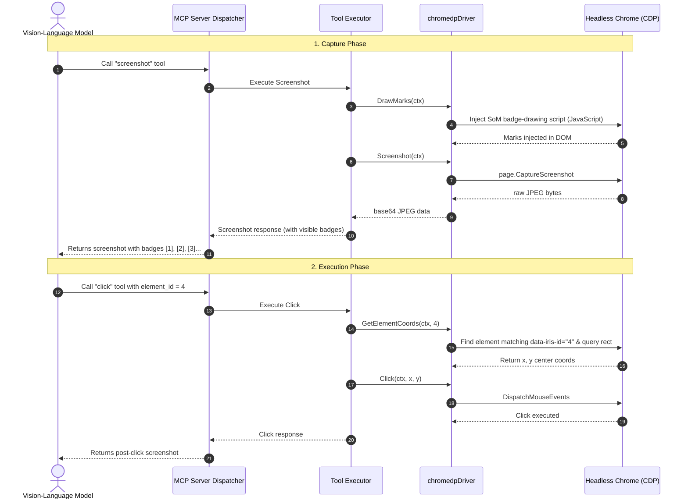

# Architecture Reference Document (ARD): Set-of-Mark (SoM) Visual Grounding

## Metadata
* **Status**: Implemented / Approved
* **Author**: Igor Komlew
* **Date**: May 9, 2026
* **Component**: `Iris` (MCP Browser Execution Server)
* **Target Audience**: AI Agents, Multi-Modal Vision-Language Models (e.g., Gemma 2 26B), Human Developers

---

## 1. Executive Summary & Context

Automated web browser agents using coordinate-based mouse input traditionally rely on multi-modal vision-language models (VLMs) to analyze raw screenshots and predict precise pixel coordinates `(x, y)` of target interactive elements. This approach exposes severe limitations:
* **Spatial Disorientation**: Smaller or locally run models are excellent at textual reasoning but struggle with raw coordinate prediction (spatial grounding), leading to misses, click drifts, and automation fragility.
* **Semantic Deficit**: A raw screenshot lacks explicit indicators of which elements are interactive, forcing models to guess click boundaries.

**Set-of-Mark (SoM)** addresses these problems by dynamically injecting visible, uniquely numbered badges (marks) over all interactive elements on the webpage right before a screenshot is taken. 

```
+-------------------------------------------------------------+
|  [1] Home   [2] Products   [3] Contact                      |
|                                                             |
|  Welcome to our store!                                      |
|                                                             |
|  [4] Click Here to Sign Up                                  |
+-------------------------------------------------------------+
```

With SoM, the VLM's task is simplified from **predicting absolute spatial geometry** to **reading a visible number** (e.g., `"Click on element 4"`). The click tool is then upgraded to resolve this element ID into precise pixel coordinates on the screen.

---

## 2. Design Goals

1. **Seamless Automation**: SoM rendering must occur automatically right before a screenshot is captured.
2. **Backward Compatibility**: Existing coordinate-based clicking (`x` and `y`) must remain fully functional as a fallback.
3. **Thread Safety**: All browser DOM manipulations and query actions must serialize via the driver's mutex (`d.mu`) to prevent chromedp concurrent command dispatch errors.
4. **Clean Code & Low Complexity**: Implement coordinate resolution while strictly conforming to linter rules (e.g., avoiding nested `if` statements that violate `nestif` complexity thresholds).
5. **Robust Error Handling**: Handle element absence gracefully, log warnings instead of throwing critical failures if badges fail to draw, and provide actionable feedback.

---

## 3. Workflow & Technical Flow

The following sequence diagram outlines how the Set-of-Mark flow operates during screen capture and subsequent click injection:



---

## 4. Component Architecture Changes

### A. Core Driver Interface
We extended the `Driver` interface in [browser.go](file:///c:/Users/igork/lanthorn/iris/internal/browser/browser.go) with two new methods:

```go
type Driver interface {
    // ... existing methods
    DrawMarks(ctx context.Context) error
    GetElementCoords(ctx context.Context, id int) (int, int, error)
}
```

### B. Chrome DevTools Protocol (chromedp) Implementation
Implemented in [chromedp_driver.go](file:///c:/Users/igork/lanthorn/iris/internal/browser/chromedp_driver.go):

* **`DrawMarks`**: Locks `d.mu` to serialize CDP traffic. Injects an IIFE (Immediately Invoked Function Expression) that:
  1. Removes stale badges (`.iris-som-mark`).
  2. Queries all candidate interactive selectors (`button`, `a`, `input`, `select`, `textarea`, `[role="button"]`).
  3. Validates visibility constraints (width > 0, height > 0, visibility != `'hidden'`, opacity != `'0'`).
  4. Tags matching elements with a custom attribute `data-iris-id`.
  5. Dynamically appends a yellow absolute-positioned badge with a bold black identifier near the element's top-left boundary, styled to overlay on top of any page content (`z-index: 2147483647`).
* **`GetElementCoords`**: Locks `d.mu`. Executes a query looking up `[data-iris-id="%d"]`, gets its bounding client rectangle, and returns the mathematical center coordinates.

### C. Screenshot Integration
In [capture.go](file:///c:/Users/igork/lanthorn/iris/internal/tools/capture.go), `DrawMarks` is injected transparently before screenshot capture:

```go
if err := t.Driver.DrawMarks(ctx); err != nil {
    t.Logger.WarnContext(ctx, "failed to draw Set-of-Mark badges", "error", err)
}
b64, w, h, err := t.Driver.Screenshot(ctx)
```
If drawing fails (e.g., due to an empty page context or unexpected DOM state), the failure is warning-logged but the screenshot execution proceeds, ensuring high resilience.

### D. Click Integration with Low Complexity
In [click.go](file:///c:/Users/igork/lanthorn/iris/internal/tools/click.go), coordinate parsing is delegated to a separate, linear helper method to satisfy the `nestif` linter limit:

```go
func (t *Click) resolveCoordinates(ctx context.Context, args map[string]any) (int, int, error) {
	if _, ok := args["element_id"]; ok {
		elementID := optIntArg(args, "element_id", 0)
		if elementID <= 0 {
			return 0, 0, errors.New("element_id must be a positive integer")
		}
		x, y, err := t.Driver.GetElementCoords(ctx, elementID)
		if err != nil {
			return 0, 0, fmt.Errorf("locating element %d: %w", elementID, err)
		}
		t.Logger.InfoContext(ctx, "resolved element_id to coordinates", "element_id", elementID, "x", x, "y", y)
		return x, y, nil
	}

	x, err := intArg(args, "x")
	if err != nil {
		return 0, 0, err
	}
	y, err := intArg(args, "y")
	if err != nil {
		return 0, 0, err
	}
	return x, y, nil
}
```

---

## 5. Test Suite & Verification

To maintain high confidence and protect the repository's strict quality rules, we updated mocks and added complete unit test coverage.

### A. Mock Support
Added fields and mock methods to `mockBrowserDriver` and `mockDriver` in [tools_test.go](file:///c:/Users/igork/lanthorn/iris/internal/tools/tools_test.go) and [browser_test.go](file:///c:/Users/igork/lanthorn/iris/internal/browser/browser_test.go).

### B. New Unit Tests
1. **Screenshot Injection Verification (`TestScreenshot_Success`)**:
   Asserts that `DrawMarks` is invoked automatically when calling Screenshot's execute routine.
2. **Successful Badge Clicking (`TestClick_ElementID`)**:
   Injects a valid `element_id` argument, asserts that coordinates are queried via `GetElementCoords`, and verifies that the correct coordinate payload is passed to the underlying browser driver.
3. **Graceful Fault Injection (`TestClick_ElementIDError`)**:
   Verifies that a driver query error for a missing badge returns a helpful descriptive error to the calling agent.

---

## 6. Linter and Build Compliance

The entire codebase complies with the strict `.golangci.yml` rules:
* **`go imports` / Alignment**: All mock structures and code blocks are formatted correctly via `gofmt`.
* **`nestif`**: Complex conditional branches were refactored into early returns and linear guard clauses, reducing nesting depth from `5` to `1`.
* **`perfsprint`**: Static error messages are created with `errors.New` instead of formatting calls.

Execution of the static analysis tool was completely clean:
```powershell
$ golangci-lint run --timeout=5m ./...
0 issues.
```

And all tests passed successfully:
```powershell
$ go test -v ./...
PASS
ok  	github.com/LanthornHQ/iris/internal/browser	0.080s
ok  	github.com/LanthornHQ/iris/internal/mcp    	0.178s
ok  	github.com/LanthornHQ/iris/internal/tools  	0.138s
```
